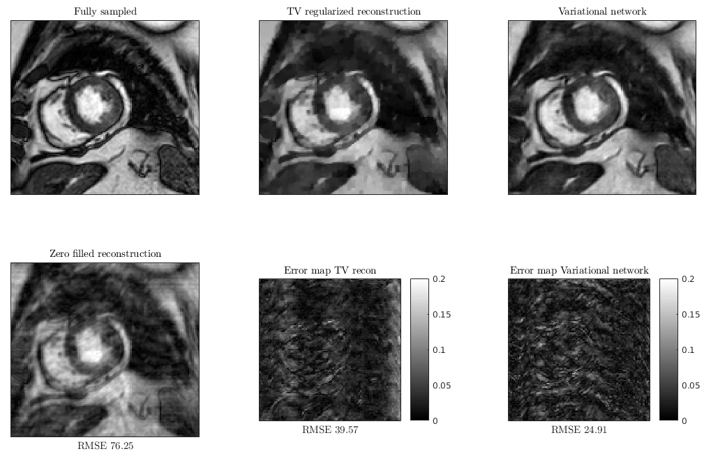
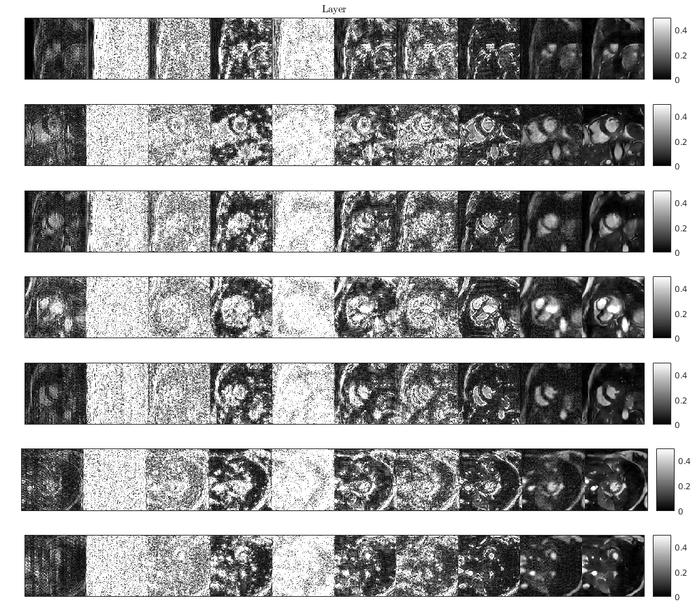
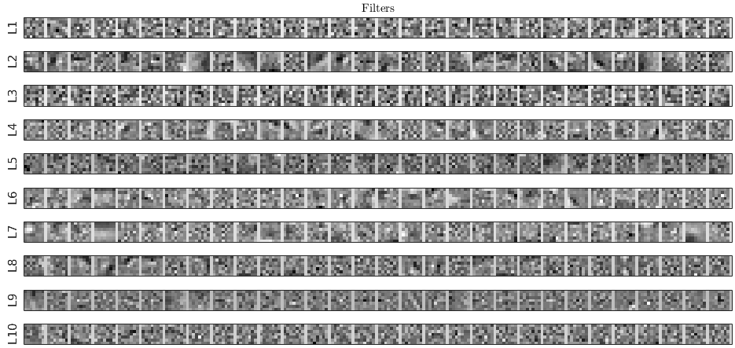
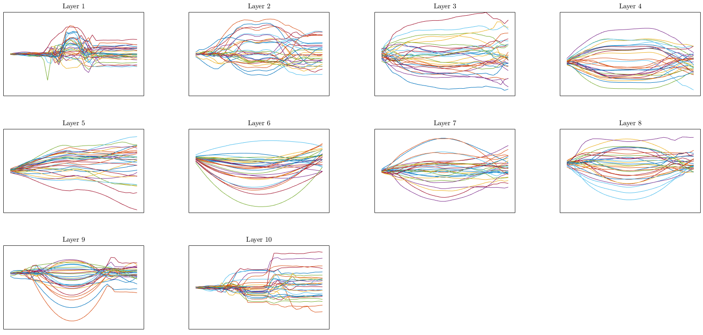

# Variational Networks for image reconstruction in tensorflow
This is a generic implementation of Variational Network (loop unrolling) for MR image reconstruction, proposed by [Hammerick et al.](https://arxiv.org/abs/1704.00447). 
MRI data used to train the network is introduced and described by [Johannes Schmidt and Sebastian Kozerke](http://dev.ismrm.org/2017/3991.html).

## Running the code 
* Download 2D short axis cardiac MRI dataset https://polybox.ethz.ch/index.php/s/E9FgAzi21iVJiF5
* Inspect configuration of the network in `recon_model_300_066.py`. We used:
  * 10 layers
  * 7x7 filters
  * 30 filters per layer
  * 35 knots to parametrize activations
  * cubic interpolation for activations
* Run `example.sh` for training
* Run matlab script `report_imgs.m` for illustrations of reconstruction and learned parameters

## Demo
For training we used fully sampled 128x128 short axis MR images of the heart with artificially generated smooth phase offset.
The k-space was retrospectively undersampled to achieve acceleration factor of ~3. 
Variational Network reconstruction was compared to total variation (TV) regularized reconstruction (with the optimal regularization weight).

Reconstruction for each layer of the network:

Learned filters (real part):

Learned activation functions (integral of activation, i.e. element-wise potentials):

## Important Notes
* We are reconstructing smaller images compared to original work. Hence different filter sizes are used.
* Multi coil acquisition as well as coil sensitivity maps are not modelled.
* Batch size is fixed at configuration time.
* Cubic interpolation is used by default instead of RBF, since it is more memory efficient. You can choose `linear`, `cubic`, or `RBF` in the network configuration.
* Maximal estimated filter response is fixed for all layers.

## 
The code is developed by Valery Vishnevskiy, [Cardiac Magnetic Resonance group](http://www.cmr.ethz.ch/), Institute for Biomedical Engineering, ETH Zurich.
